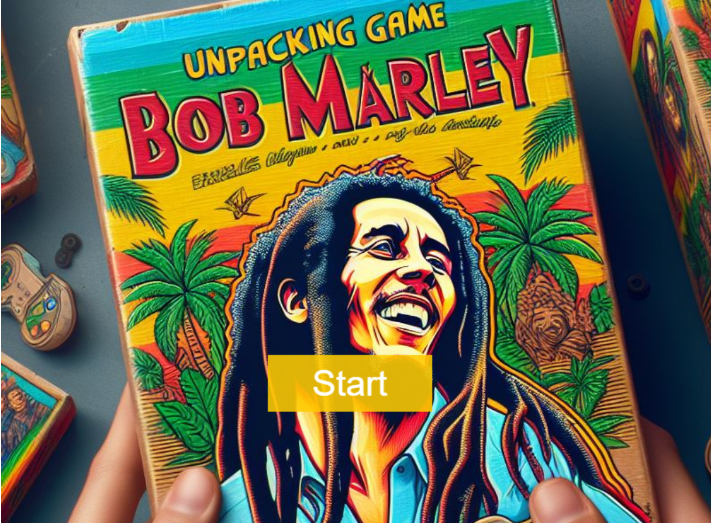
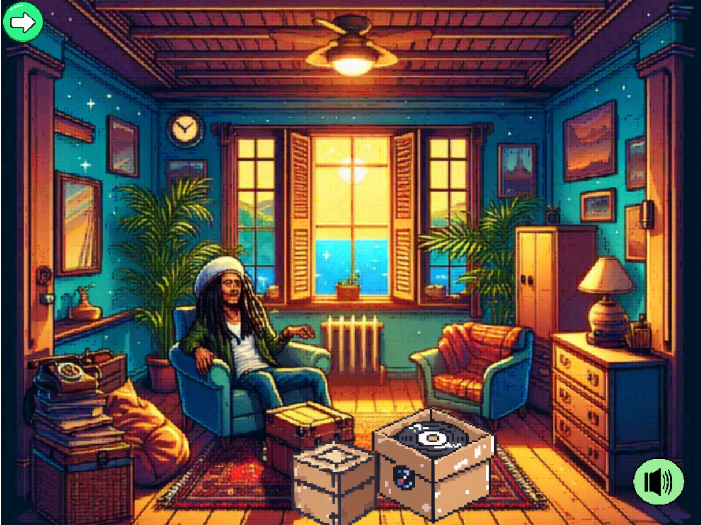

# Bob Marley - From Refugee to Legend

## Overview

"Bob Marley - From Refugee to Legend" is an educational and engaging game designed to provide players with an immersive experience of Bob Marley's life, focusing on his journey as a refugee and his rise to legendary status. The game aims to foster empathy and understanding of refugee experiences through interactive storytelling and vibrant visuals inspired by Bob Marley's iconic style.

## Internship Project

This game is developed as part of an internship project, with the main goal of creating an impactful and informative game using Rosebud AI and the Phaser game framework. The project combines technical skill development with creative storytelling to produce a meaningful educational tool.

## Features

- **Educational Content**: Learn about the life of Bob Marley and the challenges faced by refugees.
- **Interactive Scenes**: Explore different paths and pivotal moments in Marley's life through engaging gameplay.
- **Reggae-Inspired Design**: Enjoy a rich atmosphere with vibrant colors and reggae-inspired elements.
- **Unpacking Game Style**: Unlock various scenes and events as you progress through the game.

## Technology Stack

- **Rosebud AI**: Utilized for generating assets and enhancing the creative process.
- **Phaser**: A powerful framework for developing 2D games, used to build and run the game.

## Live link:

https://costea47.github.io/Bob-Marley---From-Refugee-to-Legend-Rosebud-Ai--intership-game-/

## Live on RosebudAi

https://play.rosebud.ai/projects/f029d46d-867d-4fb2-aac4-fb83bbfdbea9

## Usage

The following image shows the challange appearance and functionality:

## License

This project is licensed under the MIT License. See the [LICENSE](LICENSE) file for more details.

## Acknowledgements

- Special thanks to the Rosebud AI team for their support and resources.
- Inspired by the life and legacy of Bob Marley.
